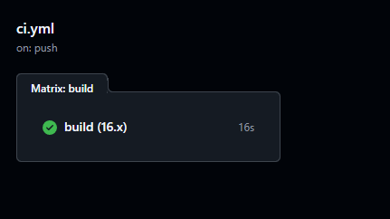
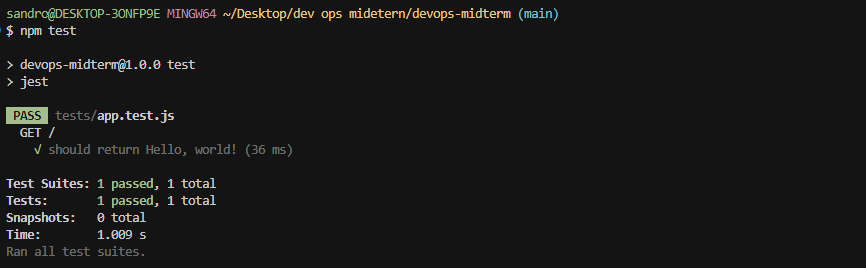
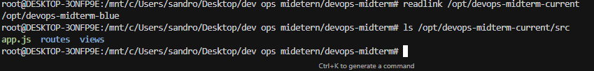
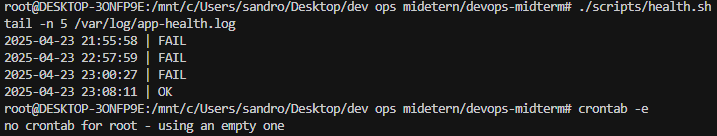
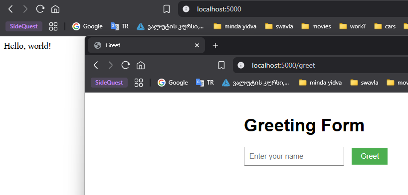
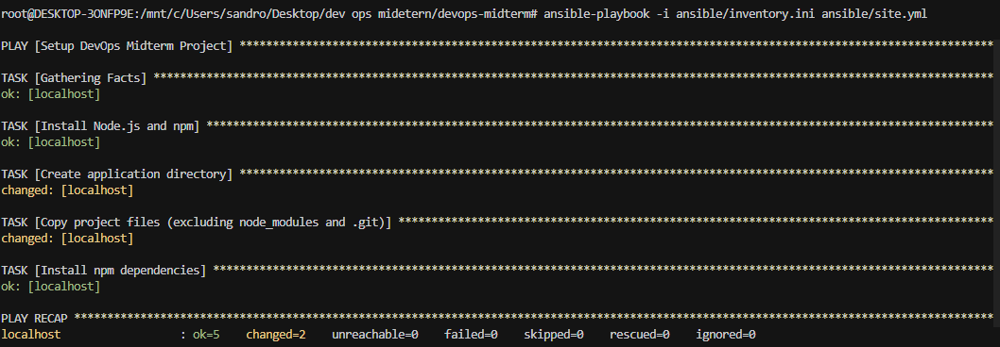

# DevOps Midterm Project Report

## Project Overview

This project demonstrates the implementation of DevOps principles in a simple web application. The application is built using Node.js and Express, with a focus on automated testing, continuous integration/deployment, infrastructure as code, and monitoring.

## Screenshots and Explanations

### 1. CI Pipeline Success

*Screenshot 1: Successful GitHub Actions workflow run on the dev branch, showing the CI pipeline passing all stages.*

### 2. Test Results

*Screenshot 2: Jest test results showing successful execution of the unit test for the root route.*

### 3. Deployment Process

*Screenshot 3: Blue-green deployment process showing the symlink switch between blue and green environments.*

### 4. Health Check Logs

*Screenshot 4: Application health check logs showing successful monitoring over time.*

### 5. Application Running

*Screenshot 5: Web application running in browser, showing both the root route and greeting form.*

### 6. Infrastructure Setup

*Screenshot 6: Ansible playbook execution showing successful infrastructure setup.*

## Technical Implementation

### Web Application
- Express.js server with two routes
- EJS templating for dynamic content
- Jest + Supertest for testing

### Version Control
- Git repository with main and dev branches
- Conventional commit messages
- Clean commit history

### Continuous Integration
- GitHub Actions workflow
- Automated testing on push/PR
- Node.js 16.x environment

### Infrastructure as Code
- Ansible playbook for setup
- Local inventory configuration
- Automated environment setup

### Continuous Deployment
- Blue-green deployment strategy
- Symlink-based switching
- Rollback capability

### Monitoring
- Health check script
- Log file generation
- Cron-based monitoring

## Conclusion

This project successfully implements key DevOps principles in a local environment. The combination of automated testing, continuous integration, infrastructure as code, and monitoring provides a robust foundation for modern software development practices. 